# 🎬 LIKE ME IN 16K (Part II)

### Smooth Drill / Trap • Neon Digital • Emotional Futurism

🎵 **Soundtrack: "Blue Diamond"** — [Download MP3](audio/Blue_Diamond_soundtrack.mp3) (3.7 MB, 2:49)

---

> **This is more than a music video. It's a cry for connection in a world that has forgotten how to look up.**
>
> Built during a mental health crisis — when screens became the wall between two people who once knew each other. When Harley helmets and Jeep keys became trophies of distraction instead of vehicles toward love. When the only thing more addictive than the phone in your hand is the person you're ignoring with it.
>
> This project was therapy. This project was survival. This project was building something beautiful out of the pain of feeling invisible to someone sitting right next to you.
>
> If you've ever felt unseen — scrolling next to someone who doesn't look up — this is for you.
>
> **You are not alone. Stay. Look up. Reach out.**

---

## 🩵 Mental Health Matters

This project was created during a period of severe mental duress. The creative process — writing, visualizing, building, rendering — served as both an outlet and a lifeline. Art heals. Creation gives purpose when everything else feels like noise.

If you're struggling:
- **988 Suicide & Crisis Lifeline** — Call or text 988 (US)
- **Crisis Text Line** — Text HOME to 741741
- **You are not a burden. You are not too much. You are worth staying for.**

---

## 💜 Donations Welcome

This project was built with $0.00 using free tools — but the human behind it is real, and currently navigating mental health challenges while building a future through code and creativity.

If this resonates with you, please consider supporting:

- **PayPal:** [paypal.me/adcockp](https://paypal.me/adcockp)
- **Chime:** $Paul-Adcock-1

Every dollar helps keep the lights on, the GPU running, and the dream alive. Thank you. 🙏

---

## 📺 Watch the Video

### With Soundtrack ("Blue Diamond")

> ⬇️ **[Download `LIKE_ME_IN_16K_Part_II_with_audio.mp4`](downloads/LIKE_ME_IN_16K_Part_II_with_audio.mp4)** — 28.2s with intro segment (3.8 MB)

> ⬇️ **[Download `LIKE_ME_IN_16K_Part_II_drop_mix.mp4`](downloads/LIKE_ME_IN_16K_Part_II_drop_mix.mp4)** — 28.2s with beat-drop segment at 30s offset (3.8 MB)

> ⬇️ **[Download `LIKE_ME_IN_16K_Part_II_FULL_TRACK.mp4`](downloads/LIKE_ME_IN_16K_Part_II_FULL_TRACK.mp4)** — Full 2:49 track with looped video (24 MB)

### Without Audio (Visuals Only)

> ⬇️ **[Download `LIKE_ME_IN_16K_Part_II.mp4`](downloads/LIKE_ME_IN_16K_Part_II.mp4)** — 28.2s, no audio (3.3 MB)

### Soundtrack Only

> ⬇️ **[Download `Blue_Diamond_soundtrack.mp3`](audio/Blue_Diamond_soundtrack.mp3)** — Full 2:49 track (3.7 MB)

> 💡 *GitHub doesn't embed video previews. Click any download link above to save the file and play it locally.*

---

## 🎞️ Scene-by-Scene Breakdown with Animated Previews

### Scene 1 — "Crystal Dreams" 🌙
*Neon apartment, phone glow, endless scrolling*

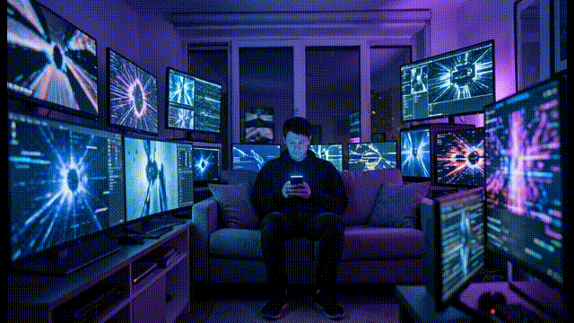

> ⬇️ [Download clip_01.mp4](downloads/clip_01.mp4) · AI-animated (Wan2.2)

### Scene 2 — "Corporate Toys / Digital Maze" 📦
*Helmets, gadgets, ghost-like partner*

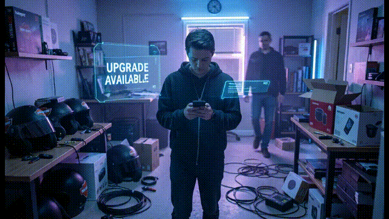

> ⬇️ [Download clip_02.mp4](downloads/clip_02.mp4) · AI-animated (Wan2.2)

### Scene 3 — "Frozen Connection" ❄️
*Slow-mo reach, glitch flicker, partner doesn't notice*

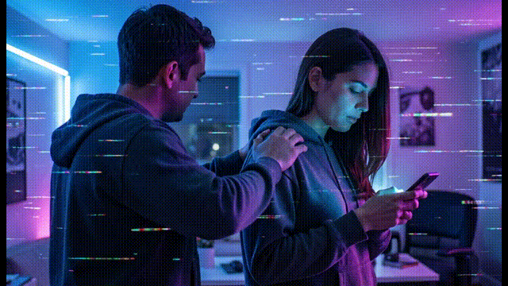

> ⬇️ [Download clip_03.mp4](downloads/clip_03.mp4) · AI-animated (Wan2.2)

### Scene 4 — "Neon Bounce / Chorus" 🏙️
*Rooftop cityscape, drone orbit, drill bounce energy*

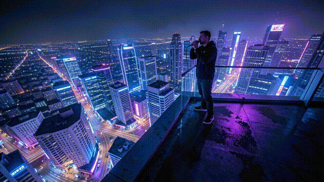

> ⬇️ [Download clip_04.mp4](downloads/clip_04.mp4) · Ken Burns zoom-in

### Scene 5 — "Real World vs Screen World" 🚙
*Jeep with engine running, warm vs cold split*

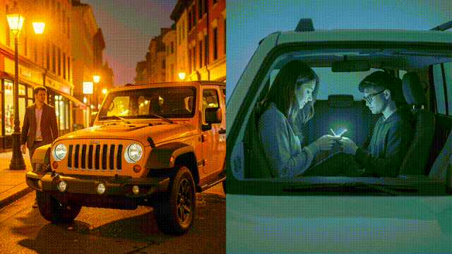

> ⬇️ [Download clip_05.mp4](downloads/clip_05.mp4) · Ken Burns pan-right

### Scene 6 — "Break the Interface" 💫
*Holographic tunnel, swiping barriers, particle effects*

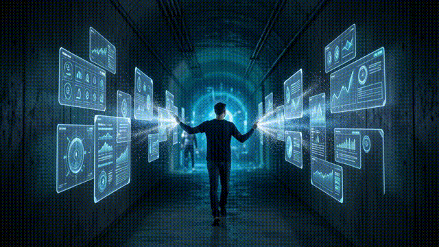

> ⬇️ [Download clip_06.mp4](downloads/clip_06.mp4) · Ken Burns zoom-in

### Scene 7 — "Return to Reality" 🌅
*Sunrise, gold tones, leaving distractions behind*


> ⬇️ [Download clip_07.mp4](downloads/clip_07.mp4) · Ken Burns zoom-out

### Scene 8 — "Stay With Me" 🤝
*Hands touching, phone falls and cracks, fade to black*

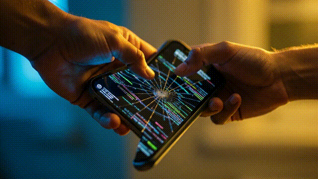

> ⬇️ [Download clip_08.mp4](downloads/clip_08.mp4) · Ken Burns zoom-in

---

## 🎤 Lyrics

Full lyrics available in **[`LYRICS.md`](LYRICS.md)**

> *"Где же ты, мой друг, придй / Like me, like me, la-la-la-Like me / Lost deeper in your crystal dreams / Like me, remix me (remix me)"*

---

## 🎨 Keyframe Gallery

| Scene | Thumbnail | Scene Title |
|-------|-----------|-------------|
| 1 | 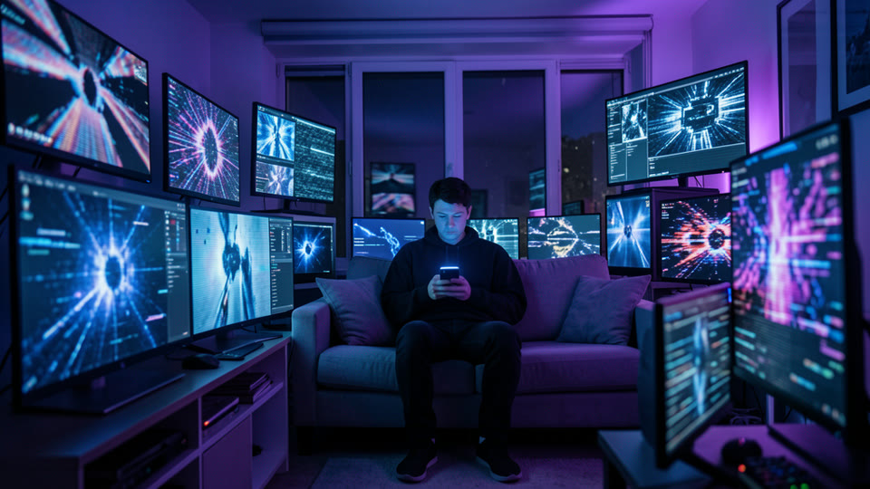 | Crystal Dreams |
| 2 | 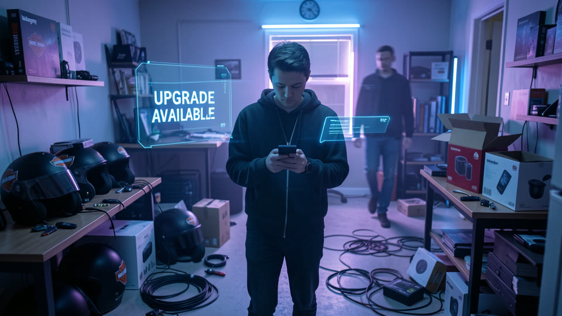 | Corporate Toys |
| 3 | 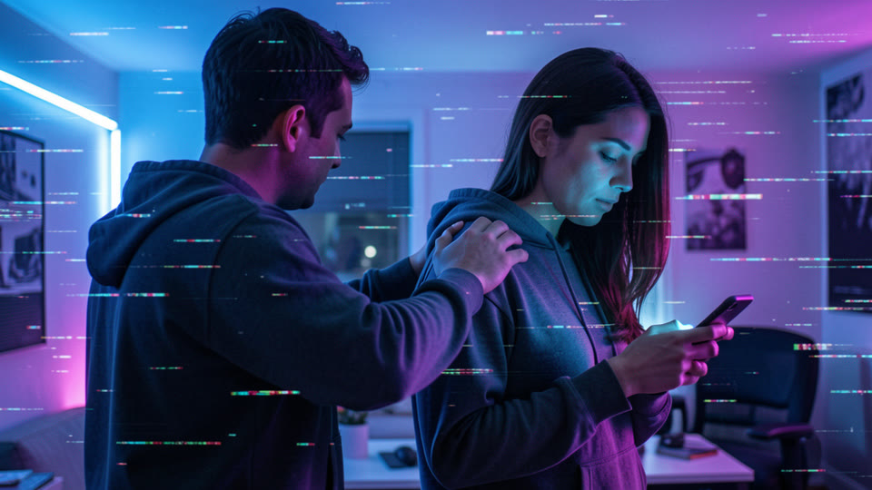 | Frozen Connection |
| 4 | 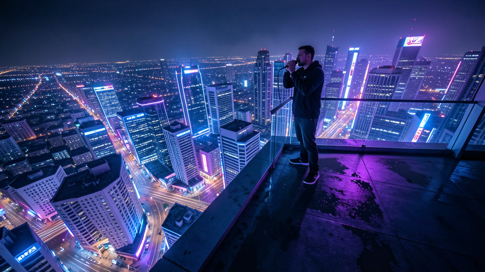 | Neon Bounce |
| 5 | 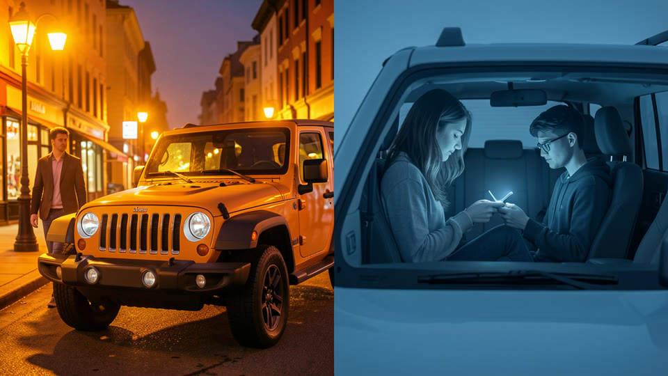 | Real vs Screen |
| 6 | 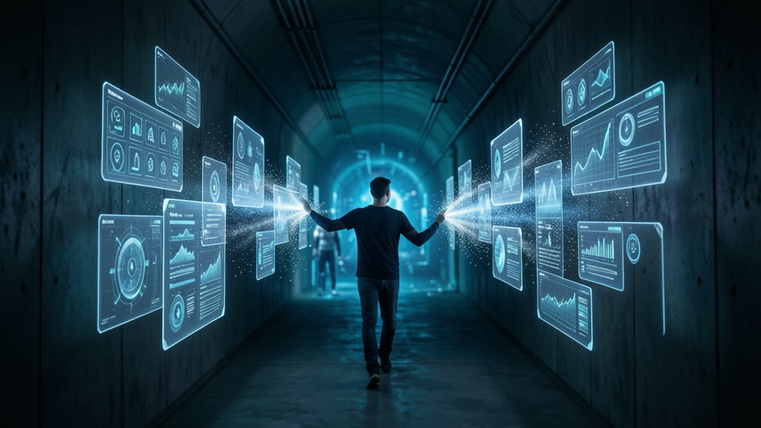 | Break the Interface |
| 7 | 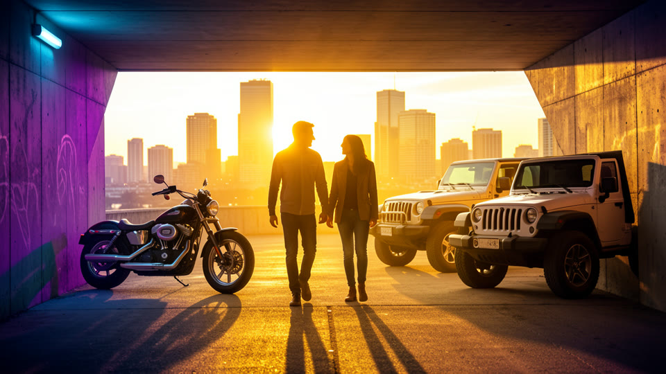 | Return to Reality |
| 8 |  | Stay With Me |

> Full-resolution PNGs available in [`frames/`](frames/)

---

## 🎵 The Vision

**"LIKE ME IN 16K"** is a story about two people — partners — drifting apart in the digital age. One reaches for connection. The other is lost in an endless scroll, surrounded by corporate toys: helmets they never wear, keys they never turn, gadgets they never open.

The music video moves through **cold digital isolation** toward **warm human reconnection**:

1. **Crystal Dreams** — A whisper in Russian. *"Где же ты, мой друг, придй."* (Where are you, my friend, come to me.) A person alone, lit only by phone glow.
2. **Corporate Toys** — The partner, surrounded by unused things, moving like a ghost. A HUD reads "UPGRADE AVAILABLE" — always upgrading, never present.
3. **Frozen Connection** — A hand reaches out. A Spanish whisper: *"corazón… why you always running…"* The partner doesn't look up. The room glitches.
4. **Neon Bounce** — The chorus drops. Rooftop. City lights like 16K pixels. Drill bounce in the camera. Freedom. But alone.
5. **Real World vs Screen World** — Warm colors vs cold blues. A Jeep with the engine running. Someone scrolling instead of driving. Life happening outside the screen.
6. **Break the Interface** — A tunnel of floating holographic UI. Each swipe dissolves a barrier. The partner appears at the end. Blurry. Getting closer.
7. **Return to Reality** — Sunrise. Neon fades to gold. Harleys and Jeeps left behind. Both walk toward each other. The Russian line echoes again.
8. **Stay With Me** — Hands touch. The phone falls. The screen cracks. Fade to black. *"Quédate aquí… stay with me."*

**The message: Put down the screen. The person next to you is reaching out. Don't let the crack be in your relationship instead of your phone.**

---

## 🔧 How It Was Built (100% Free, $0.00)

### Pipeline

1. **Keyframe generation** — 8 cinematic stills generated with [FLUX 2 Klein 9B](https://fal.ai) via FAL.ai
2. **AI animation** — 3 scenes animated with [Wan2.2 I2V Lightning](https://huggingface.co/spaces/kulkas2pintu/wan555) on Hugging Face Spaces (free, no login) before GPU quota was exhausted
3. **Fallback animation** — 5 scenes animated with ffmpeg `zoompan` Ken Burns effect (zoom/pan on still images)
4. **Assembly** — ffmpeg concat with fade in/out, all clips normalized to 1280x720 @ 16fps

### Tools Used

| Tool | Purpose | Cost |
|------|---------|------|
| [FLUX 2 Klein 9B](https://fal.ai) | Text-to-image generation | Free |
| [Wan2.2 I2V Lightning](https://huggingface.co/spaces/kulkas2pintu/wan555) | Image-to-video AI animation | Free |
| [ffmpeg](https://ffmpeg.org/) | Ken Burns effects, video normalization, final assembly | Free |
| [Hermes Agent](https://hermes-agent.nousresearch.com) | Automation, orchestration, API integration | Local |

### Scripts

- [`final_stitch.py`](final_stitch.py) — Normalizes all clips and stitches final video with fades
- [`ken_burns.py`](ken_burns.py) — Generates Ken Burns animated clips from keyframe images
- [`stitch.py`](stitch.py) — Basic concat for available clips

---

## 📁 Project Structure

```
Owl/
├── LIKE_ME_IN_16K_Part_II.mp4      # 🎬 Final video (28.2s)
├── README.md                         # This file
├── LICENSE.txt                       # License terms
├── frames/                           # 8 keyframe PNGs (FLUX 2)
│   ├── scene_01.png ... scene_08.png
├── clips/                            # 8 video clips
│   ├── clip_01.mp4 ... clip_08.mp4
├── downloads/                        # Direct download links
│   ├── LIKE_ME_IN_16K_Part_II.mp4
│   └── clip_01.mp4 ... clip_08.mp4
├── previews/                         # Animated GIFs + thumbnails
│   ├── clip_01.gif ... clip_08.gif
│   └── scene_01_thumb.jpg ... scene_08_thumb.jpg
├── normalized/                       # 1280x720 normalized clips
├── final_stitch.py                   # Final assembly script
├── ken_burns.py                      # Ken Burns effect generator
└── stitch.py                         # Basic concat script
```

---

## ⚖️ License & Copyright

© 2024-2026 **Paul Adcock / OwlLogics**. All rights reserved.

- **Patent rights reserved** under 35 U.S.C. 287a
- **MIT license** applies to copyright only
- **Commercial use** requires HMAC-SHA256 license key
- **Personal use** is free
- **Legal counsel** on all intellectual property

This project was created by Paul Adcock, creator of:
- [OwlLogics/AutoSeq](https://github.com/Turtle-PB/-OwlLogics) — Supply chain automation
- **OwlAI Studio** — AI tooling platform
- **LegalPath** — Legal services PWA
- **Hermes Workflow Runner** — Local-first AI workflow automation

---

## 🦉 Creator

**Paul Adcock** — Developer, creator, and storyteller building at the intersection of code and consciousness.

- 🎵 **Suno:** [suno.com/@paul0wl](https://suno.com/@paul0wl) — AI-generated music
- 🎬 **YouTube:** [youtube.com/@Nabbit0wl](https://www.youtube.com/@Nabbit0wl) — Creative content & dev logs
- 💻 **GitHub:** [github.com/Turtle-PB](https://github.com/Turtle-PB) — Code & projects

Creator of:
- [OwlLogics/AutoSeq](https://github.com/Turtle-PB/-OwlLogics) — Supply chain automation (SAP IDoc/BAPI, YMS, OEM)
- **OwlAI Studio** — AI tooling platform with MCP Hub
- **LegalPath** — Legal services PWA (28 views)
- **Hermes Workflow Runner** — Local-first AI workflow automation

---

## 🛠️ How to Build Something Like This

Want to create your own AI music video? Here's a gentle guide to the tools and the mindset — no secrets, just the path.

### The Stack (All Free)

| Step | Tool | What It Does | Where |
|------|------|-------------|-------|
| 1 | **Write the concept** | Your vision, scene-by-scene | Pen & paper or your AI assistant |
| 2 | **Generate keyframes** | Turn text prompts into cinematic still images | [FLUX 2](https://fal.ai) or any text-to-image AI |
| 3 | **Animate the stills** | Convert images to short video clips with motion | [Wan2.2 I2V](https://huggingface.co/spaces/kulkas2pintu/wan555) on Hugging Face Spaces |
| 4 | **Fallback motion** | If the AI video API rate-limits you, use Ken Burns zoom/pan | [ffmpeg](https://ffmpeg.org/) `zoompan` filter |
| 5 | **Generate the soundtrack** | Create music that matches your emotional arc | [Suno AI](https://suno.com) |
| 6 | **Stitch it together** | Concatenate clips, add fades, mux audio | [ffmpeg](https://ffmpeg.org/) |
| 7 | **Automate everything** | Orchestrate the whole pipeline end-to-end | [Hermes Agent](https://hermes-agent.nousresearch.com) by Nous Research |

### The Mindset

1. **Start with the story** — Every frame should serve the emotion, not the other way around
2. **Use free tools aggressively** — Hugging Face Spaces, FAL.ai, ffmpeg, Suno. $0 is a feature, not a limitation
3. **When GPU quotas hit, pivot** — Ken Burns effects look great when the AI can't render
4. **Write it all down** — Scripts in the repo so others can reproduce and remix
5. **Your pain is your art** — This whole project was built during a mental health crisis. The best creative work often comes from the hardest places

### What You'd Need on Your Machine

```
- Python 3.11+
- ffmpeg (for video stitching)
- An AI assistant (Hermes, or any coding agent)
- Internet access (for HF Spaces, FAL, Suno)
- A story to tell
```

### The Pipeline Scripts in This Repo

Read through these to see exactly how it works:
- [`final_stitch.py`](final_stitch.py) — Normalize + concat clips with fade in/out
- [`ken_burns.py`](ken_burns.py) — Generate zoom/pan motion on still images
- [`mux_audio.py`](mux_audio.py) — Layer soundtrack onto video
- [`stitch.py`](stitch.py) — Basic clip concatenation

> 💡 *The hardest part isn't the code — it's the vision. Anyone can run ffmpeg. Not everyone can write "Где же ты, мой друг, придй" and mean it.*

---

## 🙏 Acknowledgments

This project was built with [Hermes Agent](https://hermes-agent.nousresearch.com) by Nous Research — an AI assistant that automated the entire pipeline from concept to GitHub. Every tool used was free. Every dollar saved was a dollar earned.

**Special thanks to:**
- The open-source community behind Wan2.2 and FLUX
- [Hugging Face](https://huggingface.co) for providing free GPU access
- [FAL.ai](https://fal.ai) for the FLUX 2 model
- [Suno](https://suno.com) for making music creation accessible
- Everyone who creates free tools that make art possible

---

*If this project moved you, please share it. If it helped you feel less alone, please reach out to someone today. The screen is not a substitute for a hand to hold.*

**Put down the phone. Look up. Stay.** 💜
